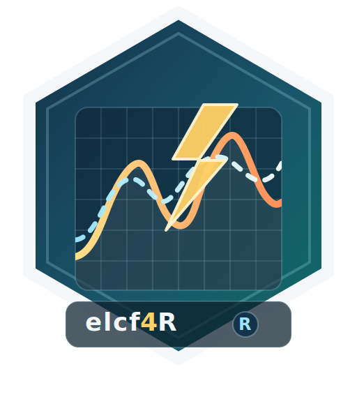

<!-- README.md is generated from README.Rmd. Please edit that file -->

```{r setup, include = FALSE}
knitr::opts_chunk$set(
  collapse = TRUE,
  comment = "#>",
  fig.path = "man/figures/README-",
  out.width = "100%",
  dpi=300,fig.width=7,
  fig.keep="all"
)
library(elcf4R)

.elcf4r_available_data <- local({
  pkg_data <- utils::data(package = "elcf4R")
  if (is.null(pkg_data$results)) {
    character()
  } else {
    as.character(pkg_data$results[, "Item"])
  }
})

.elcf4r_load_data <- function(name) {
  if (!(name %in% .elcf4r_available_data)) {
    return(FALSE)
  }
  utils::data(list = name, package = "elcf4R", envir = environment())
  TRUE
}

.elcf4r_benchmark_summary <- function(object_name, dataset_label) {
  if (!exists(object_name, inherits = FALSE)) {
    return(NULL)
  }
  x <- get(object_name, inherits = FALSE)
  if (!is.data.frame(x) || nrow(x) == 0L) {
    return(NULL)
  }
  transform(
    aggregate(
      cbind(nmae, nrmse, smape, mase) ~ method,
      data = x,
      FUN = function(v) round(mean(v, na.rm = TRUE), 4)
    ),
    dataset = dataset_label
  )
}

invisible(lapply(
  c(
    "elcf4r_iflex_benchmark_results",
    "elcf4r_storenet_benchmark_results",
    "elcf4r_lcl_benchmark_results",
    "elcf4r_refit_benchmark_results"
  ),
  .elcf4r_load_data
))
```
# elcf4R: Forecasting Individual Electricity Load Curves 

## Frédéric Bertrand, Fatima Fahs and Myriam Maumy

<!-- badges: start -->
[](https://github.com/fbertran/elcf4R/actions/workflows/R-CMD-check.yaml)
[](https://github.com/fbertran/elcf4R/actions/workflows/rhub.yaml)
<!-- badges: end -->

Implements Kernel Wavelet Functional (KWF),
    clustered KWF, Generalized Additive Models (GAM), Multivariate
    Adaptive Regression Splines (MARS) and RNN LSTM models to
    forecast individual electricity load curves, following the
    methodology described in Fahs (2023) and related articles and
    posters. Includes normalized dataset adapters for iFlex,
    StoreNet, Low Carbon London and REFIT, scaffolded download/read
    support for IDEAL and GX, compact shipped example panels, and
    saved benchmark artifacts.
    
This site was created by F. Bertrand and the examples reproduced on it were created by F. Bertrand, F. Fahs and M. Maumy.

## Installation

You can install the latest version of the elcf4R package from [github](https://github.com) with:

```{r, eval = FALSE}
devtools::install_github("fbertran/elcf4R")
```

## Current Scope

The exported forecasting methods currently covered by the package are:

- `elcf4r_fit_gam()`
- `elcf4r_fit_mars()`
- `elcf4r_fit_kwf()`
- `elcf4r_fit_kwf_clustered()`
- `elcf4r_fit_lstm()`

The current dataset adapters and shipped benchmark artifacts cover:

- iFlex
- StoreNet (`H6_W`)
- Low Carbon London
- REFIT

The current download helpers are:

- `elcf4r_download_elmas()`
- `elcf4r_download_storenet()`
- `elcf4r_download_ideal()`
- `elcf4r_download_gx()`

Scaffolded, unshipped dataset adapters:

- `IDEAL`: `elcf4r_download_ideal()` and `elcf4r_read_ideal()` provide a
  first-pass aggregate-electricity scaffold built around the hourly summaries in
  `auxiliarydata.zip`. The current Edinburgh DataShare record states `CC BY
  4.0`. No IDEAL-derived package dataset is shipped in this release.
- `GX`: `elcf4r_download_gx()` and `elcf4r_read_gx()` provide a secondary
  transformer/community-level scaffold from the official figshare dataset
  record. GX is not treated as part of the package's core individual-household
  benchmark set, and no GX-derived package dataset is shipped in this release.
  Licence terms should be rechecked against the official dataset record before
  any redistribution.

The current unshipped scaffold readers are:

- `elcf4r_read_ideal()`
- `elcf4r_read_gx()`

## Shipped example and benchmark datasets

The package now ships compact example panels and saved benchmark results for
iFlex, StoreNet, Low Carbon London and REFIT, so the main documentation can
run without external downloads. These artifacts are derived from local raw
files through the reproducible scripts in `data-raw/`.

The current shipped benchmark artifacts are:

- iFlex: `15` households, `28` train days, `7` test days
- StoreNet: `1` household (`H6_W`), `5` train days, `2` test days
- Low Carbon London: `1` thermosensitive household, `56` train days, `7` test days
- REFIT: `2` thermosensitive households, `56` train days, `7` test days

### Vignettes

There are more insights and examples in the vignettes.

```{r, eval=FALSE}
vignette("elcf4R-iflex-workflow", package = "elcf4R")
vignette("elcf4R-datasets-vignette", package = "elcf4R")
```

## Quick Benchmark Summary

The shipped benchmark artifacts now cover iFlex, StoreNet, Low Carbon London
and REFIT. The same workflow is available programmatically through
`elcf4r_build_benchmark_index()` and `elcf4r_benchmark()`.

```{r}
benchmark_summary <- Filter(
  Negate(is.null),
  list(
    .elcf4r_benchmark_summary("elcf4r_iflex_benchmark_results", "iflex"),
    .elcf4r_benchmark_summary("elcf4r_storenet_benchmark_results", "storenet"),
    .elcf4r_benchmark_summary("elcf4r_lcl_benchmark_results", "lcl"),
    .elcf4r_benchmark_summary("elcf4r_refit_benchmark_results", "refit")
  )
)

if (length(benchmark_summary) == 0L) {
  data.frame()
} else {
  do.call(rbind, benchmark_summary)
}
```
